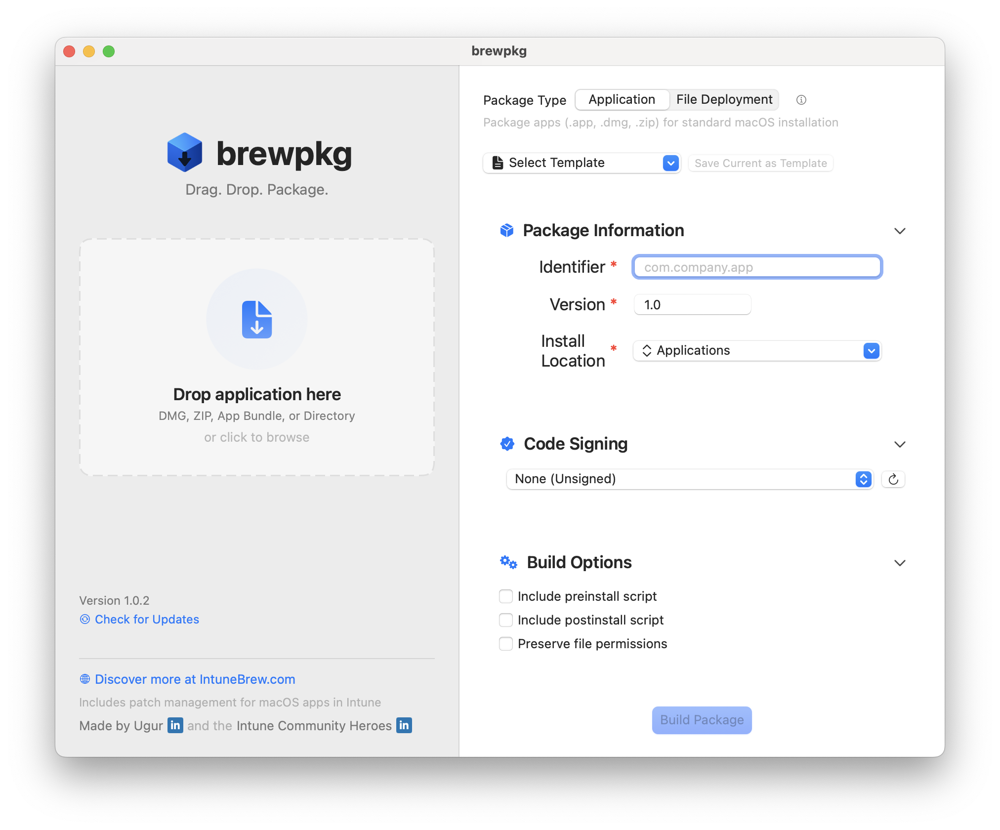

# brewpkg

A native macOS application that simplifies creating installer packages for your applications. Just drag, drop, and package.

## Download

[Download brewpkg](https://github.com/ugurkocde/brewpkg/raw/refs/heads/main/releases/brewpkg.pkg)

## Features

- Drag and drop interface for packaging macOS applications
- Support for DMG, ZIP, and App Bundle formats
- Code signing configuration
- Install location customization
- Template support for repeated packaging tasks
- Automatic updates via Sparkle framework
- Native SwiftUI interface designed for macOS

## About

Made by [Ugur Koc]([https://github.com/ugurkocde](https://www.linkedin.com/in/ugurkocde/)) and the [Intune Community Heroes](https://www.linkedin.com/groups/14802021/)
